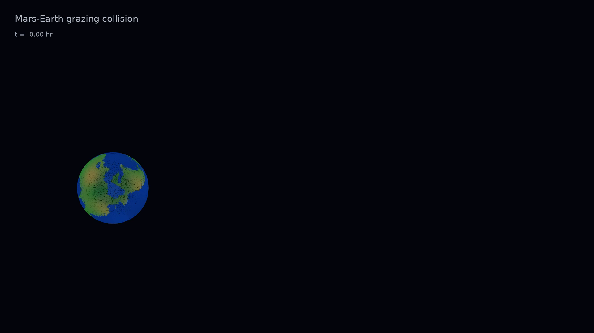
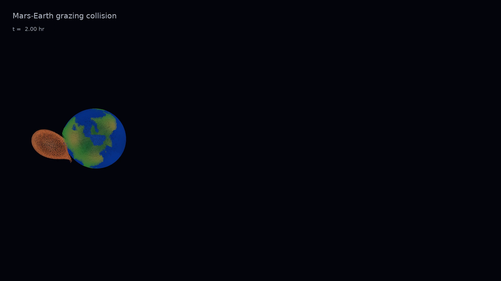
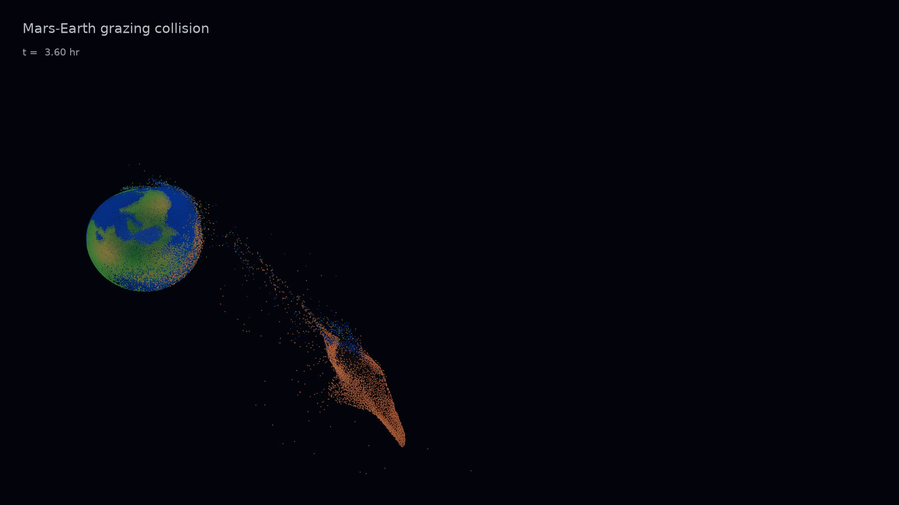
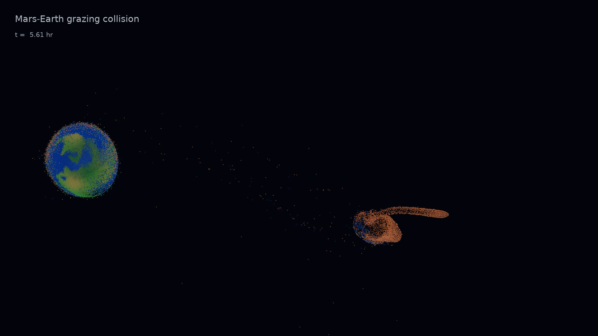
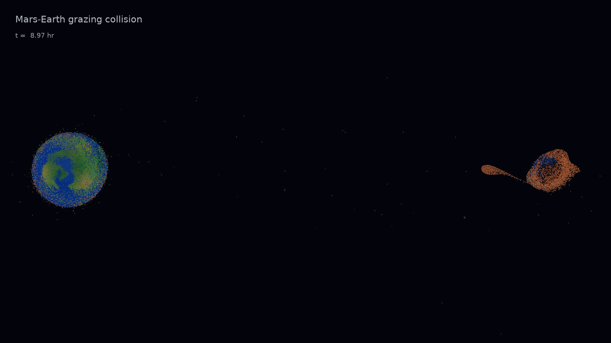

# Mars-Earth Grazing Collision

This repository contains a SWIFT/WoMa SPH setup and render pipeline for a
near-grazing Earth-Mars collision visualization.  The current products are
intended for scientifically informed presentation and animation development:
they use differentiated ANEOS bodies, settled-body initial conditions, and
advected tracer colors on Earth's surface and the Mars impactor.

The 200k-particle hero SPH calculation is complete through 92 simulated hours
(`331200 s`).  The latest blog-ready global-view animation reaches about 89
hours and carries the narrative civil-time clock beginning at 10:00 AM MDT on
August 17:

[outputs/movies/mars_earth_grazing_settled_n200000_89h_global_view_mdt_10am_179s.mp4](outputs/movies/mars_earth_grazing_settled_n200000_89h_global_view_mdt_10am_179s.mp4)

The matching wide-camera cut of the first four simulated hours is:

[outputs/movies/mars_earth_first4h_standard_wide_mdt_10am_30s.mp4](outputs/movies/mars_earth_first4h_standard_wide_mdt_10am_30s.mp4)

The earlier 36-hour diagnostic master remains available at:

[outputs/movies/mars_earth_grazing_settled_n200000_36h_direct_view_75s.mp4](outputs/movies/mars_earth_grazing_settled_n200000_36h_direct_view_75s.mp4)

The earlier 9-hour direct-view movie remains available at:

[outputs/movies/mars_earth_grazing_settled_n200000_9h_direct_view_45s.mp4](outputs/movies/mars_earth_grazing_settled_n200000_9h_direct_view_45s.mp4)

An ApJ-style draft manuscript is available as both source and PDF:

- [paper/mars_earth_collision_apj.tex](paper/mars_earth_collision_apj.tex)
- [paper/mars_earth_collision_apj.pdf](paper/mars_earth_collision_apj.pdf)

## Direct-View Sequence

Frames below are extracted from the earlier 45-second inertial-frame animation.
The newer global-view movie uses a wider fixed camera so the surviving remnant
and extended debris stream remain legible through the second encounter.

| Initial | Approach |
|---|---|
|  |  |

| Maximum interaction | Departure |
|---|---|
|  |  |

| Final 9-hour state |
|---|
|  |

## Current Status

The repository is not yet a convergence-tested publication-results archive.
Large multi-GB snapshot time series are documented in
[manifests/LARGE_ARTIFACTS.md](manifests/LARGE_ARTIFACTS.md) rather than stored
directly in Git.

The hero run completed normally in two additional stages: 36--72 hours and
72--92 hours.  The final snapshot contains 215,299 SPH particles at exactly
92.0 hours.  The movies show a strong second encounter and long tidal/accretion
stream, but qualitative interpretation beyond first renewed contact remains
hydrodynamic and resolution-sensitive; a new final-clump analysis is still
needed before assigning permanent bound or escaped outcomes.

The pre-continuation three-clump calculation and its finite-radius caveats are
documented in [docs/forward_tides_note.md](docs/forward_tides_note.md).  Its
point-mass trajectories cease to be predictive at the first Roche/contact-scale
encounter; the completed SPH continuation is the relevant calculation after
that point.

## Repository map

- `src/`: initial-condition, analysis, rendering, clock, and forward-model code.
- `configs/`: exact SWIFT YAML files used in the local calculation, plus the two nonuniform output-time lists.
- `data/`: compact IC/restart files, profiles, visualization labels, and bundled Natural Earth vectors.
- `outputs/movies/`: curated presentation and resolution-ladder movies.
- `outputs/forward_tides/`: the pre-continuation three-clump model tables and figures.
- `docs/`: handoff, reproducibility, physical-interpretation, and Gold Butte narrative notes.
- `manifests/`: generated SWIFT diagnostics and the inventory of large external snapshot series.
- `paper/`: manuscript source and PDF.

Visualization sidecars named `*_labels.hdf5` are keyed by `ParticleIDs` and
store `BodyID`, `SurfaceClass`, initial longitude/latitude, and RGB colors.

## Physical setup

- Target is Earth mass/radius; impactor is Mars mass/radius.
- Both bodies are differentiated ANEOS Fe85Si15/forsterite objects generated with WoMa and evolved with SWIFT planetary SPH.
- Nominal geometry is 70 degrees from head-on at `1.02` times mutual escape speed, initialized about two hours before nominal contact.
- The hero calculation uses separately relaxed bodies. The direct, unrelaxed ICs retained in `data/` are legacy visualization and workflow tests, not the production starting point.
- The hot adiabatic setup mildly inflates the initial Earth analog to about `1.034 R_Earth`; it does not model a cold crust, ocean, or atmosphere.

## Software environment

The archived Python environment used CPython 3.12. A portable reconstruction is:

```bash
python3.12 -m venv .venv
.venv/bin/python -m pip install -r requirements.txt
```

SWIFT and FFmpeg are external executables. The impact run requires a SWIFT build
configured for planetary hydrodynamics and the planetary equation of state; body
relaxation additionally used a fixed-entropy SWIFT build. Exact build revisions
and configure lines are recorded in
[docs/REPRODUCIBILITY.md](docs/REPRODUCIBILITY.md).

The committed YAML files preserve the original calculation, including its local
ANEOS paths. To run one from another checkout, stage a portable copy with the
bundled helper. For example:

```bash
SWIFT_ROOT=/path/to/earth-mars-swift
.venv/bin/python src/prepare_swift_run.py \
  configs/mars_earth_grazing_smoke.yml \
  --run-dir runs/smoke \
  --eos-dir "$SWIFT_ROOT/swift/examples/Planetary/EoSTables"

cd runs/smoke
"$SWIFT_ROOT/swift/swift" --hydro --self-gravity --threads=12 \
  mars_earth_grazing_smoke.yml
```

The helper rewrites only the staged YAML, then links the required compact IC and
output-time list from this repository. Generated snapshots stay under the ignored
`runs/` directory. Platform-specific shared-library paths may still need to be set
for the local SWIFT/HDF5 build.

For the legacy direct-body IC generator, run from an ignored working directory:

```bash
mkdir -p runs/direct_n05000
cd runs/direct_n05000
../../.venv/bin/python ../../src/make_mars_earth_ic.py --n-total 5000
../../.venv/bin/python ../../src/plot_initial_conditions.py
```

SEAGen shell-population adjustment makes the nominal `n_total=5000` request
7,421 particles. Settled-body assembly uses `src/assemble_settled_impact.py` on
separately relaxed Earth and Mars snapshots; the original local wrapper scripts
are historical working-tree utilities and are not part of this curated clone.
New ladder YAMLs can be generated with `src/make_ladder_configs.py --eos-dir
/path/to/EoSTables N_TOTAL` or by setting `SWIFT_EOS_DIR`.

## Resolution and continuation status

| run | requested particles | actual initial particles | simulated duration | external snapshot storage |
|---|---:|---:|---:|---:|
| settled `n20000` | 20,000 | 23,749 | 4 h | 115 MB |
| settled `n50000` | 50,000 | 57,089 | 4 h | 257 MB |
| settled `n100000` | 100,000 | 112,486 | 4 h | 506 MB |
| hero `n200000` | 200,000 | 218,271 | 92 h | about 116 GB across stages |

The hero endpoint contains 215,299 particles. The difference from the initial
count must be handled explicitly in conservation and mass-budget work; absent IDs
must not automatically be interpreted as accreted material. The resolution ladder
establishes rendering continuity, but it has not yet established convergence of
the second-encounter outcome.

The current renderer retains full 3-D particle positions, intersects persistent
IDs across selected snapshots, and draws a dim body layer beneath depth-sorted
surface tracers. A representative rerender command is:

```bash
.venv/bin/python src/render_impact_animation.py \
  --snapshot-dir /path/to/snapshots_settled_n100000_4h \
  --basename mars_earth_grazing_settled_n100000_4h \
  --labels data/mars_earth_grazing_settled_n100000_labels.hdf5 \
  --out example.mp4 \
  --duration 30 --fps 24 --width 1920 --height 1080 \
  --view-vector 0,-0.55,0.84
```

## Analysis and narrative products

- `src/forward_tides_model.py` and `docs/forward_tides_note.md`: three-clump Newtonian/tidal model initialized at 36 hours, valid only until the first finite-size encounter.
- `src/plot_mars_earth_toomre.py`: scale-aware Earth--Mars--Moon approach diagrams.
- `src/retime_animation_clock.py`: configurable civil-time overlay used for the presentation movies.
- `docs/gold_butte_impact_timeline.txt`: conservative cold-Earth extrapolation from the Sweet Grass Hills into the SPH regime.

## Publication-quality next steps

1. Perform the 92-hour remnant, debris, binding, and particle-loss census.
2. Report energy, angular-momentum, linear-momentum, and mass conservation across every continuation boundary.
3. Repeat the second encounter at higher resolution and with plausible COM/velocity, radius, spin, thermal-state, angle, and velocity perturbations.
4. Quantify the boundary between merger, hit-and-run survival, reaccretion, stripping, and ejection rather than inferring it from this realization.
5. Archive the full snapshot series and exact external software environment in durable object storage or a data repository.

## License

This project is released under the [MIT License](LICENSE). The bundled Natural
Earth vectors are public-domain data as documented in
`data/natural_earth/README.md`. External dependencies, including SWIFT and WoMa,
retain their own licenses.
