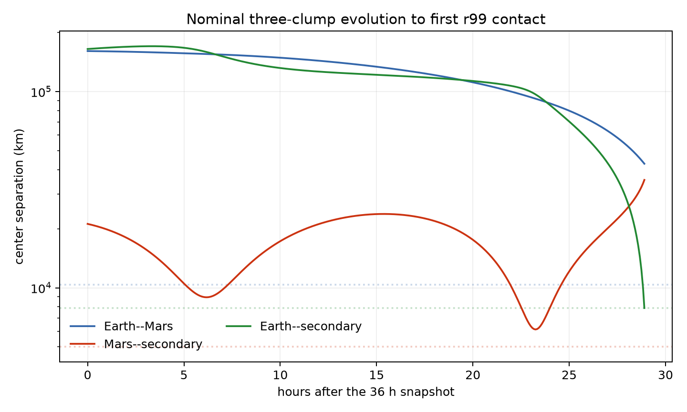
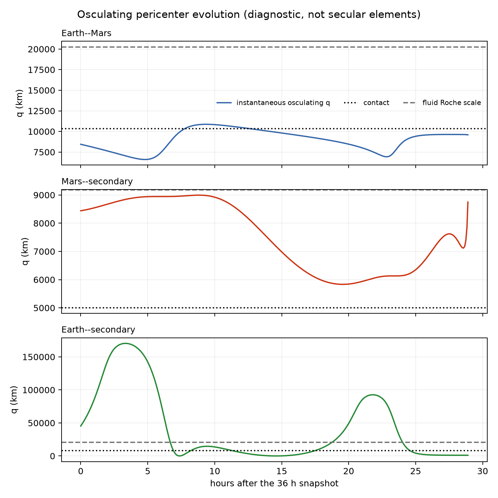
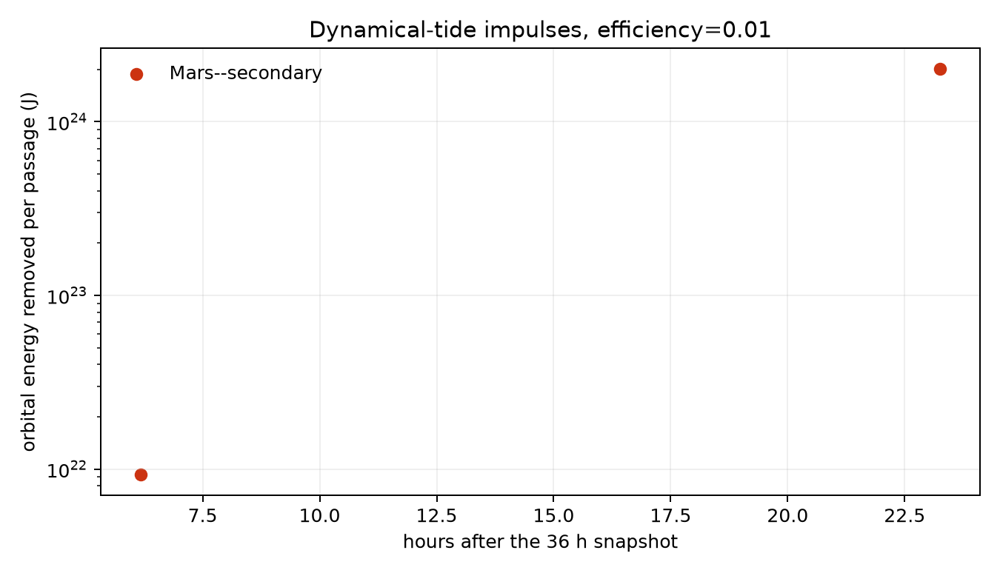
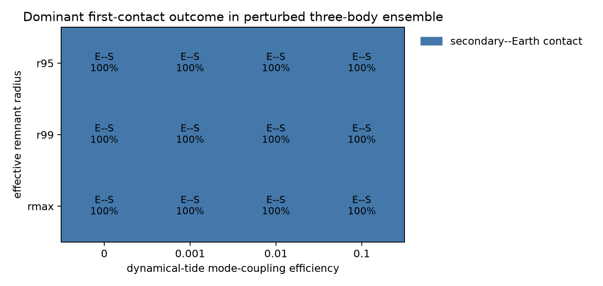

# Forward tides model for the 36 h three-clump remnant

> **Continuation update (2026-08-20).**  The recommended SPH continuation was
> subsequently carried through 92 simulated hours.  It shows that renewed
> hydrodynamic interaction does occur, so the point-mass model below should be
> read as a successful encounter-ordering diagnostic, not as a trajectory
> model after first Roche/contact-scale entry.  Quantitative clump analysis of
> the 92-hour state remains separate work.

## Result in one paragraph

The 36 h configuration is not a detached tidal binary.  The direct
Earth-remnant--Mars-remnant osculating orbit has \(q=8443\) km, below every
tested contact sum (10,002, 10,354, and 11,251 km for `r95`, `r99`, and
`rmax`).  More importantly, the nominal three-body integration routes the
Mars secondary into the Earth remnant first: it crosses the `r99` fluid Roche
scale at 28.40 h after the saved state and reaches `r99` contact at 28.901 h
(absolute simulation time 64.901 h).  If that earlier contact is
counterfactually ignored, the point-mass model reaches Earth--Mars `r99`
contact at 31.234 h after the saved state (67.234 h absolute).  Thus an SPH
continuation should expect secondary disruption/contact followed closely by a
second large-remnant encounter; it should not expect clean secular tidal
evolution.

This is a conservative hierarchy of diagnostics, not a prediction through a
collision.  All integrations stop at the first finite-radius contact.  The
later Earth--Mars timing is reported only from a point-mass counterfactual in
which the earlier secondary--Earth contact is allowed to pass through.

## Initialization

`src/forward_tides_model.py extract` reads the final SWIFT snapshot and label
sidecar, then finds friends-of-friends components with a 500 km link.  The
three largest components reproduce the independently reported clumps:

| clump | particles | mass (kg) | r95 (km) | r99 (km) | rmax (km) |
|---|---:|---:|---:|---:|---:|
| Earth remnant | 199,512 | 6.0217e24 | 6,492 | 6,617 | 7,106 |
| Mars remnant | 17,857 | 5.4896e23 | 3,510 | 3,737 | 4,145 |
| Mars secondary | 682 | 2.0982e22 | 1,208 | 1,268 | 1,283 |

The stored JSON contains particle-mass-weighted COM positions and velocities,
source/material fractions, all three radii, and approximate internal angular
momenta.  The rigid-rotation equivalents are 13.76 h for Earth, 3.39 h for
Mars, and 5.45 h for the secondary.  These spin periods are diagnostics of
distributed SPH flow, not evidence that the remnants are rigid bodies.

## Model

### Newtonian and finite-size layer

The three clump COMs are integrated with Newtonian point-mass gravity.  A run
ends when any center separation first reaches the selected sum of `r95`,
`r99`, or `rmax`.  The model also records the larger of the two directional
incompressible-fluid Roche estimates,

\[
r_{{\rm Roche},i}=2.44 R_i (M_j/M_i)^{1/3}.
\]

Roche entry is a warning rather than a hard stop because a hot, differentiated,
non-equilibrium remnant need not behave like the classical incompressible
fluid used to obtain 2.44.  It nevertheless marks where a three-point-mass
description becomes especially weak.

### Dynamical tides at detached pericenter

At an inward-to-outward radial-velocity crossing, and only if contact has not
already occurred, the code evaluates the quadrupolar encounter scale

\[
\Delta E_i = {G M_i^2\over R_i}
 \left({M_j\over M_i}\right)^2
 \left({R_i\over r_p}\right)^6 T_{2,i},
\qquad
\eta_i = \left({M_i\over M_i+M_j}\right)^{1/2}
 \left({r_p\over R_i}\right)^{3/2}.
\]

The dimensional and mass/radius scaling follows the linear mode-excitation
calculation of [Press & Teukolsky (1977)](https://doi.org/10.1086/155143).
This model does not compute remnant eigenmodes.  Instead it exposes

\[
T_{2,i}=\epsilon_{\rm dyn} w_i
\exp[-\beta\max(\eta_i-1,0)]
\]

with default `beta=2`, per-body weight `w_i=1`, and sensitivity values
`epsilon_dyn = 0, 0.001, 0.01, 0.1`.  This exponential is explicitly a tunable
adiabatic-suppression surrogate, not a calibrated (T_2(\eta)) curve for these
post-impact bodies.  The loss is capped at 25% of relative kinetic energy for
numerical safety.

The relative velocity is scaled at pericenter while pair COM momentum is
preserved.  Consequently the recorded orbital angular-momentum transfer is

\[
\Delta \mathbf L_{\rm orb}=\mu\,\mathbf r_p\times
(\mathbf v_{\rm before}-\mathbf v_{\rm after}),
\]

and has the sign of orbital damping.  The model does not evolve internal modes
or return mode angular momentum coherently on a later passage.

### Equilibrium-tide gate

A weak-friction small-e surrogate is available only when all of the following
hold: the pair is bound, (e\leq0.3), its osculating pericenter exceeds both
the fluid Roche scale and 1.2 times contact, and contact has not occurred.  It
uses

\[
t_e^{-1}={21\over2}n\sum_i {k_{2,i}\over Q_i}
{M_j\over M_i}\left({R_i\over a}\right)^5
\]

with defaults `k2=0.3` and `Q=100`, and applies radial epicyclic damping at
fixed pair orbital angular momentum.  This is the low-e intuition limit of a
weak-friction model, not the full arbitrary-e constant-time-lag equations of
[Hut (1981)](https://scixplorer.org/abs/1981A%26A....99..126H/abstract).
None of the nominal pairs passes the gate before first contact, so the chosen
`k2/Q` does not affect the reported result.

## Nominal chronology

For `r99` and `epsilon_dyn=0.01`:

| event | time after 36 h state | absolute simulation time | separation |
|---|---:|---:|---:|
| Mars--secondary enters fluid Roche scale | 5.75 h | 41.75 h | 9,177 km |
| Mars--secondary first point periapse | 6.178 h | 42.178 h | 8,946 km |
| Mars--secondary second point periapse | 23.256 h | 59.256 h | 6,133 km |
| Earth--secondary enters fluid Roche scale | 28.40 h | 64.40 h | 20,347 km |
| **Earth--secondary `r99` contact; physical model stops** | **28.901 h** | **64.901 h** | **7,885 km** |
| Earth--Mars `r99` contact, point-mass counterfactual only | 31.234 h | 67.234 h | 10,354 km |
| Earth--Mars point periapse, counterfactual only | 31.418 h | 67.418 h | 9,459 km |

The three-body perturbation raises the formal Earth--Mars point periapse from
the initial two-body value of 8,443 km to 9,459 km, but this is still inside
all tested contact envelopes.  More importantly, it occurs after the
secondary--Earth interaction has already invalidated the three-point-mass
trajectory.

The secondary does not geometrically reaccrete onto Mars in the nominal point
model before encountering Earth.  It is not a secure satellite, however: its
initial two-body \(q=8441\) km is already below the `r99` fluid Roche estimate
of 9,182 km, and its second three-body periapse falls to 6,133 km.  Disruption,
mass shedding, or altered reaccretion could therefore occur before the
point-clump Earth contact.

## Can tides avert the large-remnant re-impact?

Not in this baseline model.  At fixed two-body orbital energy, raising the
Earth--Mars periapse just to the `r99` contact sum requires about a 10.1%
increase in specific orbital angular momentum, or

\[
\Delta L_{\rm orb}\simeq 4.26\times10^{33}\ \mathrm{kg\,m^2\,s^{-1}}.
\]

The inferred prograde remnant spins are slower than the roughly 2.2 h orbital
pattern period at `r99` contact, so ordinary dissipative tides transfer angular
momentum out of the orbit rather than supply the required positive increment.
A super-synchronous spin torque, coherent mode return, or hydrodynamic
deflection could change that statement, but those require measured remnant
mode/spin structure and an SPH continuation.

Evaluating the linear dynamical-tide scale at the `r99` contact distance gives
`7.7e27 J` for `epsilon_dyn=0.01` and `7.7e28 J` for 0.1.  These are about
0.22% and 2.2%, respectively, of the inbound radial kinetic energy there.  The
calculation is already marginal at geometric contact and cannot be trusted as
a hydrodynamic energy budget, but it indicates that the tested dissipative
tides are much more likely to add heating and hasten capture than to halt or
lift the passage.

The two detached Mars--secondary impulses are much smaller: approximately
`9.3e21 J` and `2.0e24 J` for `epsilon_dyn=0.01`.  Both passages are inside the
classical Roche scale, where disruption physics dominates the linear impulse.

## Sensitivity ensemble

The outcome map contains 32 common random perturbations per cell, 384 runs in
total.  Each Cartesian component receives a Gaussian perturbation of 100 km
and 20 m/s on the outer (Earth versus Mars-system) Jacobi-like state and 50 km
and 10 m/s on the Mars--secondary state.  This is a deliberately broad model
envelope for clump definition and non-rigid COM motion, not a posterior error
distribution.

Every perturbed run, for every radius definition and every tested tide
efficiency, reaches Earth--secondary contact first.  Across the cells, the
5th--95th percentile first-contact interval is approximately 28.3--29.4 h
after the 36 h snapshot.  No run reaches Mars--secondary or Earth--Mars
geometric contact first.  Nine of the 32 common perturbation draws per cell
briefly pass the equilibrium-tide gate for at least one pair, but none enters a
long-lived detached regime and the first-contact ordering is unchanged.  This
is strong evidence that the ordering is robust within the stated envelope,
but it is not a probability of the real hydrodynamic outcome.









## Qualitative outcome assessment

| proposed outcome | point/tide model assessment |
|---|---|
| Earth--Mars re-impact or merger-like encounter | **Likely close encounter/contact.** Direct two-body (q) is inside all contact envelopes; the counterfactual three-body track also contacts. Merger versus hit-and-run requires SPH. |
| Mars remnant survives a second close passage | **Unknown.** The model reaches the secondary--Earth hydrodynamic event first and cannot validly propagate the later large-remnant encounter. |
| Secondary survives as a satellite | **Unlikely as an intact secure satellite in this model.** It crosses a Roche-like scale twice and is then routed into Earth contact. |
| Secondary reaccretes onto Mars | **Not geometrically predicted before first Earth contact**, but Roche-scale disruption could cause partial reaccretion outside the point-clump model. |
| Secondary stripped by Earth | **Favored qualitatively.** The intact-point surrogate proceeds all the way to Earth contact; disruption may begin at the earlier Earth Roche entry. |
| Three-body instability or ejection | **Not seen before contact** in the tested ensemble. Post-contact ejection remains unconstrained. |

## Reproduction

From the GitHub-ready repository, using the SWIFT project environment:

```bash
PY=/Users/greglaughlin/Projects/earth-mars-swift/.venv/bin/python
SNAP=/Users/greglaughlin/Projects/earth-mars-swift/trial_mars_earth_grazing/snapshots_settled_n200000_19h_to_36h/mars_earth_grazing_settled_n200000_19h_to_36h_1020.hdf5
LABELS=/Users/greglaughlin/Projects/earth-mars-swift/trial_mars_earth_grazing/mars_earth_grazing_settled_n200000_labels_coast_eroded.hdf5

env -u DYLD_LIBRARY_PATH "$PY" src/forward_tides_model.py extract \
  --snapshot "$SNAP" --labels "$LABELS" \
  --output outputs/forward_tides/clumps_36h.json

MPLCONFIGDIR=/tmp/mars_tides_mpl env -u DYLD_LIBRARY_PATH "$PY" \
  src/forward_tides_model.py run \
  --states outputs/forward_tides/clumps_36h.json \
  --output-dir outputs/forward_tides \
  --ensemble-samples 32
```

Machine-readable tables include clump/pair diagnostics, physical-stop events,
counterfactual point-mass events, per-passage tide losses, the unperturbed
radius/efficiency grid, all ensemble trials, and the aggregated outcome map.

## Recommended next analysis

The requested SPH continuation is now complete through 92 h.  The next step is
to measure, rather than infer visually, how the secondary, Mars remnant, Earth
remnant, and extended stream exchange mass and angular momentum across the
42.2, 59.3, and roughly 65--67 h encounter windows.  Track persistent particle
IDs through several checkpoints, audit the particle removals, and repeat the
clump/binding census at the final snapshot before assigning survival,
reaccretion, stripping, or escape labels.
